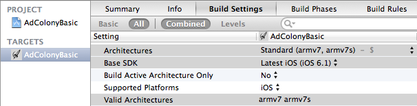
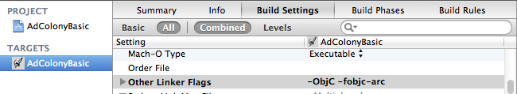
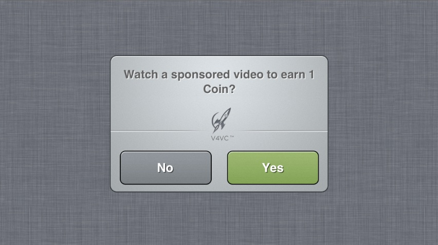
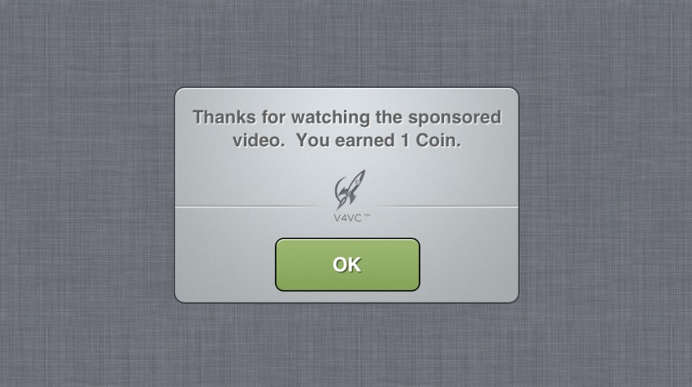

###AdColony SDK取得URL###
*AdColony-Unity-SDK
https://github.com/AdColony/AdColony-Unity-SDK

*AdColony-iOS-SDK 
https://github.com/AdColony/AdColony-iOS-SDK

*AdColony-AdobeAIR-SDK
https://github.com/AdColony/AdColony-AdobeAIR-SDK

---
###Notes###
* AdColony 2.4 iOS SDK はiOS8で動作確認がされております。
* AdColony 2.4 iOS SDK はAdColony 2.0とのAPIの互換性はありません。

---
###Contents###
* [Xcode Project Setup](#xcode-project-setup)
* [Showing Videos Ads](#showing-videos-ads)
    * [Showing Interstitial Videos](#showing-interstitial-videos)
    * [Showing V4VC Videos](#showing-v4vc-videos)
    * [Showing Instant Feed Videos](#showing-instant-feed-videos)

------

##Xcode Project Setup##
AdColonyを導入するにはXcodeでいくつか設定する必要があります。

`AdColony.framework`をプロジェクトにコピー(ドラッグ)してください。また、Adcolonyを利用する全てのターゲットに追加してください。

**Target > Build Settings > Architectures**を開いて、ベースSDKは6.0以降に設定してください。アーキテクチャは`armv6`を設定していないことを確認してください。



**Target > Build Phases > Link Binary With Libraries**を開いて、下記のライブラリとフレームワークを追加してください。
* `libz.1.2.5.dylib`
* `AdColony.framework`
* `AdSupport.framework`  (Set to Optional)
* `AudioToolbox.framework`
* `AVFoundation.framework`
* `CoreGraphics.framework`
* `CoreMedia.framework`
* `CoreTelephony.framework`
* `EventKit.framework`
* `EventKitUI.framework`
* `MediaPlayer.framework`
* `MessageUI.framework`
* `QuartzCore.framework`
* `Social.framework`  (Set to Optional)
* `StoreKit.framework`  (Set to Optional)
* `SystemConfiguration.framework`


**Target > Build Settings > Linking > Other Linker Flags**を開いて、下記の二つフラグを設定してください。
* `-ObjC`
* `-fobjc-arc` (AdColonyではARCを設定していないプロジェクトでも使うことができます。)



##Showing Videos Ads##
AdColony SDKには、AdColonyを導入するための３つのサンプルアプリケーションが存在します。`AdColonyBasic`アプリでは[[Showing Interstitial Videos]] 部分を実装し、 `AdColonyV4VC`アプリでは[[Showing V4VC Videos]] 部分を実装しています。さらに詳しく知りたい場合は、[API Details](https://github.com/AdColony/AdColony-iOS-SDK/wiki/API-Details)を参照してください。

##Showing Interstitial Videos##
AdColony interstitial ads are a video ad immediately followed by an endcard.

###Instructions###
[[Xcode Project Setup]]を実装した後に、下記の手順でインタースティシャル広告を表示することができます。

1. Glossomにてapp ID、zone IDを発行しお渡し致します。 
2. アプリ起動するところにAdColonyの設定関数（configure）でapp ID, zone IDを設定してください。
3. 広告を表示するコードを実装してください。

###Code Example - AdColonyBasic Sample App###
このアプリはSDKパッケージ内のAdColonyBasicというサンプルアプリです。インタースティシャルを実装するための必要な手順は以下になります。

**AppDelegate.m**
```objc
#import <AdColony/AdColony.h>

@implementation AppDelegate
/* Class body ... */

- (BOOL)application:(UIApplication *)application didFinishLaunchingWithOptions:(NSDictionary *)launchOptions {
    /* Method body ... */

    [AdColony configureWithAppID:@"appbdee68ae27024084bb334a"
                         zoneIDs:@[@"vzf8fb4670a60e4a139d01b5"]
                        delegate:nil
                         logging:YES];
    return YES;
}
```
ほとんどのアプリ内には`application:didFinishLaunchingWithOptions:` メソッドというアプリを起動するときのエントリーポイントが存在します。この中で`configureWithAppID:zoneIDs:delegate:logging:`を呼んで各情報を設定してください。これを設定することで、アプリ起動した後にすぐ動画広告を再生できるように広告を準備します。その際、app IDとzone IDを自分のアプリのIDの入れ替えること、そしてAdColonyヘッダーファイルをインポートして下さい。

**ViewController.m**
```objc
#import <AdColony/AdColony.h>

@implementation ViewController

/* Class body ... */
-(IBAction)triggerVideo {
    [AdColony playVideoAdForZone:@"vzf8fb4670a60e4a139d01b5" withDelegate:nil];
}
```
上記では`playVideoAdForZone:withDelegate:`メソッドを実装した例です。このメソッドではAdColonyに指定したzone idですぐ動画広告を再生することができます。このメソッドはアプリのなかでどこでも動画広告を表示したいところで呼び出すことができます。このサンプルでは`triggerVideo`メソッドはInterface Builderの一つのボタンとリンクしてます。その際、zone IDを先に発行された独自のIDに入れ替えて下さい。

### 注意点 ###
1. 稀にAdColony側にて動画広告の再生を準備できていない可能性があります。その場合、動画再生するメソッドを呼んでもアプリは反応しません。そのため、AdColonyの設定（configure）から動画再生メソッドを呼び出すまで時間がかかる可能性があります。
その際は video-ad@glossom.co.jp までお問い合わせ下さいませ。
2. アプリ内に音楽や音声がある場合、AdColony動画広告の再生の間は再生しないようご設定下さい。`AdColonyAdDelegate` プロトコルの中にあるコールバックを利用してコントロールできます。詳しくは`AdColonyAdDelegate` [here](https://github.com/AdColony/AdColony-iOS-SDK/wiki/API-Details#adcolonyaddelegate-protocol-reference)を参照してください。またはAdColonyAdvancedサンプルアプリを参照してください。

##Showing V4VC Videos##
AdColony V4VC (Videos-for-Virtual-Currency)は[[interstitial ads|AdColony Product Overview]]の上で実装した動画広告を再生完了した時点で、ユーザーに仮想通貨を付与することができるシステムです。AdColony V4VCはユーザーの仮想通貨残高を追跡しません。ユーザーに仮想通貨を付与すべき時点でアプリケーションに通知する機能を提供しています。

クライアント側で仮想通貨の残高を管理してるアプリには、V4VCのクライアントモードで簡単に実装できます。サーバー側で仮想通貨の残高を管理してる場合、V4VCはよりセキュリティーの高いサーバー側モードによって、付与する時点でサーバーに通知することも可能です。

###クライアントモード実装手順###
先に[[Xcode Project Setup]]を実装してください。クライアントモードは[[AdColony interstitial ads|Showing-Interstitial-Videos]]の実装する方法とほぼ同様であり、いくつかの機能が追加されます。

1. Glossomにてapp ID、zone IDの発行しお渡し致します。 
2. 枠の設定ページの"Virtual Currency Rewards" を有効にして、currency name と reward amount　を設定してください。
3. アプリ起動するところにAdColonyの設定関数（configure）でapp ID, zone ID, an AdColonyDelegateを設定してください。
4. `AdColonyDelegate` V4VCリワードコールバックを実装してください。その中でユーザーの仮想通貨の残高とそのUIを更新してください。
5. AdColonyのV4VCの動画広告とポップアップメッセージを表示するコードを実装してください。

###Code Example - AdColonyV4VC Sample App###
このサンプルアプリはSDKと一緒に配布されたAdColonyV4VCというサンプルです。クライアントモードでのV4VC広告の実装を説明しています。

**AppDelegate.h**
```objc
#import <AdColony/AdColony.h>
/* Declarations ... */

@interface AppDelegate : UIResponder <UIApplicationDelegate, AdColonyDelegate>
```
上記は`AdColonyDelegate`を実装したプロトコルを宣言しています。利便性のため`UIApplicationDelegate`プロトコルを実装したクラスと同じクラスで実装します。他のクラスでも対応可能ですが、AdColonyに渡したそのクラスのインスタンスはアプリ内にあり続ける必要があります。

**AppDelegate.m**
```objc
@implementation AppDelegate
/* Class body ... */

- (BOOL)application:(UIApplication *)application didFinishLaunchingWithOptions:(NSDictionary *)launchOptions {
    /* Method body ... */

	[AdColony configureWithAppID: @"appbdee68ae27024084bb334a"
					     zoneIDs: @[ @"vzf8e4e97704c4445c87504e" ]
					    delegate: self
					     logging: YES];
    return YES;
}
```
上記の通り、`configureWithAppID:zoneIDs:delegate:logging:`を使って設定します。インタースティシャルでの導入方法と大きな違いはございませんが、唯一delegateパラメーターを設定する必要があります（上記は`self`に設定した）。このコードはアプリ起動する場所へ記述して下さい。通常は`application:didFinishLaunchingWithOptions:`メソッドになります。その際、AdColony app ID と zone IDsを発行された独自のIDに入れ替える必要があります。

**AppDelegate.m**
```objc
- ( void ) onAdColonyV4VCReward:(BOOL)success currencyName:(NSString*)currencyName currencyAmount:(int)amount inZone:(NSString*)zoneID {
	NSLog(@"AdColony zone %@ reward %i %i %@", zoneID, success, amount, currencyName);

	if (success) {
		NSUserDefaults* storage = [NSUserDefaults standardUserDefaults];

		// Get currency balance from persistent storage and update it
		NSNumber* wrappedBalance = [storage objectForKey:kCurrencyBalance];
		NSUInteger balance = wrappedBalance && [wrappedBalance isKindOfClass:[NSNumber class]] ? [wrappedBalance unsignedIntValue] : 0;
		balance += amount;

		// Persist the currency balance
		[storage setValue:[NSNumber numberWithUnsignedInt:balance] forKey:kCurrencyBalance];
		[storage synchronize];

		// Post a notification so the rest of the app knows the balance changed
		[[NSNotificationCenter defaultCenter] postNotificationName:kCurrencyBalanceChange object:nil];
	} else {
		[[NSNotificationCenter defaultCenter] postNotificationName:kZoneOff object:nil];
	}
}
```
上記は`AdColonyDelegate`プロトコルメソッド`onAdColonyV4VCReward:currencyName:currencyAmount:inZone:`の実装例です。基本的には、ユーザーは動画を再生した後にAdcolonyからこのメソッドをコールバックします。このメソッドでユーザーに仮想通貨を付与することできますが、実装自体はアプリによって異なります。このサンプルではユーザーの仮想通貨残高を`NSUserDefaults`に保存します。

上記ではAdColonyから`success`パラメータをコールバックして渡したクライアントサイドV4VCでは、このパラメーターがAdColonyのサーバーからこのリワードを認証したかどうかを意味しています。成功した場合、このメソッドではリワードアマウントをユーザーの通貨情報に追加し、さらにアプリのUIに対しても情報を更新するよう設定してください。失敗した場合、不正の対象の可能性になるため、ユーザーに通貨（対価）を戻しさないようにしてください。安全のためこのサンプルでは、その後V4VC広告をアプリ内で表示しないように設定致しました。

**ViewController.m**
```objc
#import <AdColony/AdColony.h>

@implementation ViewController

/* Class body ... */
-(IBAction)triggerVideo {
    [AdColony playVideoAdForZone:@"vzf8e4e97704c4445c87504e"
                    withDelegate:nil
                withV4VCPrePopup:YES
                andV4VCPostPopup:YES];
}
```
上記は`playVideoAdForZone:withDelegate:withV4VCPrePopup:andV4VCPostPopup:`メソッドを実装した例です。このメソッドでは、指定したzone idですぐAdColonyの動画広告を再生することができ、アプリのなかでどこでも動画広告を表示したい場所で呼び出すことが可能です。サンプルでは`triggerVideo`メソッドはInterface Builderの一つのボタンとリンクしてます。導入時はzone IDを発行された独自のIDに入れ替えて下さい。

下記のように、ポップアップパラメーターはAdColonyに動画再生の前後にポップアップを表示タイミングを設定します。




--

###サーバー側モード手順###
サーバ側モードはAdColonyはアプリに仮想通貨をリワードする通知を行う前に、アプリのサーバー側に先に通知する以外はクライアント側モードとほぼ同じです。AdColonyはアプリのサーバーにユーザーとリワードを含めて様々な情報を渡します。それをもってサーバー側がそのリワードを認証または否認証することができます。この方式を実装するにはクライアントモード手順を実装した上に、下記を実装してください。

1. `AdColonyDelegate` V4VC のリワードコールバックを実装してアプリサーバーからもらった仮想通貨の情報を更新してください。
2. AdColony SDKにユーザ識別子(custom identifier)を設定してください。これは毎回リワードコールバックするときにアプリのサーバ側にも送信されます。これを使用することで、通貨を付与するユーザを特定することができます。
3.Glossomにてzoneのサーバ側V4VCを有効にし、ポストバック用のURLを設定致します。
4. ポストバック先のURL実装、そして有効なレスポンスをしてください。

###Code Example - Custom ID###
ユーザーを識別するために、カスタマイズユーザーIDを設定してください。よく使われるのはvendor identifier、開発者ごとに固有のものであります。

1. AdColonyのアカウント情報を設定する*前*に、`[AdColony setCustomID:];`を呼び出してユーザーIDを設定してください。このIDはサーバーとのすべてのコミュニケーションに使用されます。
2. Zoneの設定画面でコールバックURLの最後に `&custom_id=[CUSTOM_ID]` を追加してください。

**AppDelegate.m**
```objc
#import <AdColony/AdColony.h>

@implementation AppDelegate
/* Class body ... */
- (BOOL)application:(UIApplication *)application didFinishLaunchingWithOptions:(NSDictionary *)launchOptions {
	/* Method body ... */
	[AdColony setCustomID:[AdColony getVendorIdentifier]]; //before configure
	[AdColony configureWithAppID: @"appbdee68ae27024084bb334a"
					     zoneIDs: @[ @"vzf8e4e97704c4445c87504e" ]
					    delegate: self
					     logging: YES];
}
```

###Code Example - Server-side Callback###
server-side V4VCを設定したzoneを利用の場合、ポストバック先のURLは有効なレスポンスをするため、下記の手順を従って確認してください。

1. URLパラメーターを読んで発行されたzoneの秘密鍵を使って発行したかどうかを確認してください。
2. パラメーターに含まれたユーザーIDは有効であるかどうかを確認してください。
3. 重複チェックを行って、ユーザーに指定したアマウントとタイプの通貨を付与してください。
4. 上記を踏まえて、有効なレスポンスをリターンしてください。

AdColonyからコールバックするURLの仕様は下記でございます。括弧内に囲まれているパラメータはアプリケーション実装時の情報により動的にセットされます。
```
[http://www.example.com/anypath/callback_url.php]?id=[transaction id]&uid=[AdColony device id]&amount=[currency amount to award]&currency=[name of currency to award]&open_udid=[OpenUDID]&udid=[UDID]&odin1=[ODIN1]&mac_sha1=[SHA-1 of MAC address]&verifier=[security value]
```

URL Parameter | Type | Purpose
--- | --- | ---
id | Positive long integer | Unique V4VC transaction ID
uid | String | AdColony device ID
amount | Positive integer | Amount of currency to reward
currency | String | Name of currency to reward
open_udid | String | OpenUDID
udid | String | Apple UDID
odin1 | String | Open Device Identification Number (ODIN)
mac_sha1 | String | SHA-1 hash of lowercase colon-separated MAC address
custom_id | String | Custom user ID
verifier | String | MD5 hash for message security

参考例：下記はPHP + MySQLで実装した例です。

```php
<?php
	$MY_SECRET_KEY = "This is provided by adcolony.com and differs for each zone";

	$trans_id = mysql_real_escape_string($_GET['id']);
	$dev_id = mysql_real_escape_string($_GET['uid']);
	$amt = mysql_real_escape_string($_GET['amount']);
	$currency = mysql_real_escape_string($_GET['currency']);
	$open_udid = mysql_real_escape_string($_GET['open_udid']);
	$udid = mysql_real_escape_string($_GET['udid']);
	$odin1 = mysql_real_escape_string($_GET['odin1']);
	$mac_sha1 = mysql_real_escape_string($_GET['mac_sha1']);
	$custom_id = mysql_real_escape_string($_GET['custom_id']);
	$verifier = mysql_real_escape_string($_GET['verifier']);

	//verify hash
	$test_string = "" . $trans_id . $dev_id . $amt . $currency . $MY_SECRET_KEY .
		$open_udid . $udid . $odin1 . $mac_sha1 . $custom_id;
	$test_result = md5($test_string);
	if($test_result != $verifier) {
		echo "vc_noreward";
		die;
	}

	$user_id = //TODO: get your internal user id using one of the supplied identifiers
	// OpenUDID, AdColony ID, ODIN1, custom ID can be accessed via a method call in the AdColony client SDK

	//check for a valid user
	if(!$user_id) {
		echo "vc_noreward";
		die;
	}
	//insert the new transaction
	$query = "INSERT INTO AdColony_Transactions(id, amount, name, user_id, time) ".
		"VALUES ($trans_id, $amt, '$currency', $user_id, UTC_TIMESTAMP())";
	$result = mysql_query($query);
	if(!$result) {
		//check for duplicate on insertion
		if(mysql_errno() == 1062) {
			echo "vc_success";
			die;
		}
		//otherwise insert failed and AdColony should retry later
		else {
			echo "mysql error number".mysql_errno();
			die;
		}
	}
	//TODO: award the user the appropriate amount and type of currency here
	echo "vc_success";
?>
```
注意、`TODO`のところにはアプリケーション特定のロジックを実装してください。上記のコードで使ったMySQLデータベースは下記のSQLで作成できます。(通貨名を`enum`にインサートするのを忘れないようにして下さい)

```mysql
CREATE TABLE `AdColony_Transactions` (
  `id` bigint(20) NOT NULL default '0',
  `amount` int(11) default NULL,
  `name` enum('Currency Name 1') default NULL,
  `user_id` int(11) default NULL,
  `time` timestamp NULL default NULL,
  PRIMARY KEY  (`id`)
) ENGINE=MyISAM DEFAULT CHARSET=utf8;
```

##Showing Instant Feed Videos**
**Instant-Feed広告のご導入につきましては、Video-ad@glossom.co.jpにお問い合わせください。Instant-Feed広告のご利用につきましては、現在限定的にご案内させて頂いております。**

AdColony Instant-Feedは広告を直接アプリのコンテンツに組み込むことができる、ネイティブ広告型のアドユニットです。

Instant-Feed広告は二つのエクスペリエンスがあります。
1.広告のテキスト、画像、動画を含む広告枠が自分のビューに組み込まれます。
2.ユーザーがその広告枠をタップした時にAdcolony SDKによって自動でフルスクリーンの動画が再生されます。

[[assets/instant-feed-example.png|alt=Instant-Feed Integration Example]]

###Instructions###
[[Xcode Project Setup]]を実装した後に、下記の手順でAdColony Instant-Feed広告を表示することができます。

1.  Glossomにてapp ID、zone IDを発行しお渡し致します。 
2. Adcolonyの日本国内サポートチームvideo-ad@glossom.co.jp　へご連絡頂いた後に、GlossomにてInstant-Feed広告の利用を確認できたらzoneのInstant-Feed広告を有効にしご連絡致します。
3. アプリ起動をする場所にAdColonyの設定関数（configure）でapp ID, zone IDを設定してください。
4. `AdColonyNativeAdView`オブジェクトを取得するコード書いて、それをユーザーインタフェースから呼び出せるようにを実装してください。
5. `AdColonyNativeAdView`オブジェクトのAPIを利用して、広告情報を取得して掲載したいところに配置してください。
6. 広告表示された所にスポンサーという表示を追加してください。
7. 広告が正常に一時停止、および再生することを確認してください。

###Code Example - Configuration###
SDKパッケージの中のAdColonyBasicというサンプルアプリにはアカウント情報の設定があります。Instant-Feed 広告でも設定する方法が同じです。

**AppDelegate.m**
```objc
#import <AdColony/AdColony.h>

@implementation AppDelegate
/* Class body ... */

- (BOOL)application:(UIApplication *)application didFinishLaunchingWithOptions:(NSDictionary *)launchOptions {
    /* Method body ... */

    [AdColony configureWithAppID:@"appbdee68ae27024084bb334a" 
                         zoneIDs:@[@"vzf8fb4670a60e4a139d01b5"] 
                        delegate:nil 
                         logging:YES];
    return YES;
}
```
ほとんどのアプリには`application:didFinishLaunchingWithOptions:` メソッドはアプリ起動するときのエントリーポイントです。この中で`configureWithAppID:zoneIDs:delegate:logging:`を呼んで各情報を設定してください。これを設定することで、アプリ起動した後にすぐ動画広告を再生できるように広告を準備します。app IDとzone IDsを自分のアプリのIDに入れ替えるのを忘れないてください。AdColonyヘッダーファイルをインポートするのも忘れないようにして下さい。

###Code Example - Using the AdColonyNativeAdView###
**ViewController.m**
```objc
#import <AdColony/AdColony.h>
#import <AdColony/AdColonyNativeAdView.h>

@implementation ViewController
/* Class body ... */

- (void)buildPlacement {
    AdColonyNativeAdView* adView = [AdColony getNativeAdForZone:@"vzf8e4e97704c4445c87504e"
                                       presentingViewController:self];
    if(adView) {
        /* Ad was available, gather ad placement info */
        NSString* advertiserName = adView.advertiserName; // Required
        UIImage* advertiserIcon = adView.advertiserIcon; // Optional
        NSString* adTitle = adView.adTitle; // Optional
        NSString* adDescription = adView.adDescription; // Optional

        /* Set up the sponsored content indicator */
        NSString* sponsoredMessage = @"Sponsored Content"; // Required

        /* Style the ad's (optional) engagement button to match the app */
        UIButton* engagementButton = adView.engagementButton;
        if(engagementButton) {
        	/* Adjust button background image, font color, etc. ... */
        }

        /* Adjust the size of the native ad view */
        CGFloat adWidth = 300;
        CGFloat adHeight = [adView recommendedHeightForWidth:adWidth];
        adView.frame = CGRectMake(0, 0, adWidth, adHeight);
    }
}
```
上記の例では手順が複数記載されてます。
まず、`[AdColony getNativeAdForZone:presentingViewController:]`を利用して`AdColonyNativeAdView`オブジェクトを取得します。そして、広告が表示されるUIViewControllerのポインタを渡す必要があります。
この例では`self`です。広告が利用できない場合、この関数から`nil`をリターンされることがありますので、その場合でも正しく処理できるようにしてください。
※表示する広告がない時にレイアウト上には、該当の広告枠自体を表示しないようご設定ください。また、空白等は入れないでください。

次に、上記の例ではユーザーインタフェースに入れ込む広告情報を取得しています。
広告名、アイコン、タイトルと説明文などを取得することができます。全ての情報を表示することを推奨しますが、広告名とスポンサー名のみ必須になります。取得した文字列と画像は広告枠の`UILabel`や `UIImageView`に設定されます。
上記の例では、広告がエンゲージメントボタンを含めてるかどうかをチェックしてます。
上記情報を含んでいる場合、エンゲージメントボタンの表示をアプリに合うように調整します。ただし、エンゲージメントボタンのテキストは修正しないで下さい。

最後に、上記の例ではユーザーインタフェースにインサートする前に広告のフレームのサイズを設定しました。`AdColonyNativeAdView`は`UIView`を継承した動画広告コンポーネントやエンゲージメントボタンを表示するための全てのマシーナリーを含めているため、適切なサイズの設定が重要になります。そのためには推奨なheightを計算するヘルプメソッドが提供されています。これを使用することで広告プレースメントに無駄なスペースをなくすことが可能になります。ここまで実装したら、`AdColonyNativeAdView`とほかの広告情報を入れた`UILabel`または`UIImageView`をユーザーインタフェースにインサートできます。

###Pausing and Resuming###
Instant-FeedはiOSのスクロールできるコンテンツ向けに設計を行っています。目指すユーザーエクスペリエンスは、最初表示された際に動画再生を開始し、スクリーンからスクロールオフしたときに一時停止する表示方法です。スクリーンにスクロールバックされたときには、動画を再生し続けることができます。`AdColonyNativeAdView`はユーザー自身がコンテンツを見たことを確認したことタイミングで、自動で再生することができます。残念ながら、`UITableView` と `UIScrollView`　APIの制限のため、それらを使う場合、コードの中にスクリーンからユーザーがアウトする時とインする時に自分でコントロールする必要があります。その上に、`AdColonyNativeAdView`を含んでいるViewControllerがある場合、それ自体が消えると再現する処理も必要になります。最後に、再利用できる`UITableViewCell`を使用する際も気をつけなければいけません。

**Requirements**  
実装と有効なインプレションに関する契約上の要件を遵守するために、パブリッシャーは下記のことを遵守する必要があります。 

1. 動画広告は必ず見えるところに配置して、その上に何も重ねないで下さい。  
2. 動画広告の50%以上のピクセルが可視エリアに入ったら動画再生を始めるか続けてください。  
3. 動画広告の50%以上のピクセルが可視エリアから離れたら(どの方向でも)動画を一時停止してください。 

**Note:** Androidアプリを開発してる場合、SDKは自動て動画を再生/停止できます。 

**Scrolling Ads On-Screen and Off-Screen**  
`AdColonyNativeAdView`実装してるビューはスクリーンからスクロールアウトされる度に、広告ビューの`pause`メソッドを実行してください。スクリーンにスクロールバックされた度に`resume`実行してください。`UITableViewController`を利用してる場合、下記のように簡単に実装できます。

```objc
#import <AdColony/AdColony.h>
#import <AdColony/AdColonyNativeAdView.h>

@implementation ViewController
/* Class body ... */

- (void)tableView:(UITableView *)tableView willDisplayCell:(UITableViewCell *)cell forRowAtIndexPath:(NSIndexPath *)indexPath {
    AdColonyNativeAdView* adView = nil; /* TODO: App specific code to get the ad view for the cell ... */
    [adView resume];
}

- (void)tableView:(UITableView *)tableView didEndDisplayingCell:(UITableViewCell *)cell forRowAtIndexPath:(NSIndexPath *)indexPath {
    AdColonyNativeAdView* adView = nil; /* TODO: App specific code to get the ad view for the cell ... */
    [adView pause];	
}
```

--

**View Controller Visibility**  
下記のように、view controllerに全ての`AdColonyNativeAdView`のポインターを配列(array)に保存することを推奨します。配列にすることで、すべての動画広告を一時停止する必要があるときに、配列をループして一時停止することができます。動画広告を再開するときに再生されたことのある動画のみ再生を続けて下さい。
下記の例は`UITableViewController`を利用してるときのサンプルです。

```objc
#import <AdColony/AdColony.h>
#import <AdColony/AdColonyNativeAdView.h>

@implementation ViewController
/* Class body ... */

- (void)viewWillAppear:(BOOL)animated {
    for(UITableViewCell* cell in [self.tableView visibleCells]) {
    	AdColonyNativeAdView* adView = nil; /* TODO: App specific code to get the ad view for the cell ... */
        [adView resume];
    }
}

- (void)viewWillDisappear:(BOOL)animated {
    for(AdColonyNativeAdView* adView in adViews) {
        [adView pause];
    }
}
```

--

**Cell Re-use**  
ユーザーはコンテンツをスクロールするときに、更新しない限りそのコンテンツは変わりません。広告も同じ動作仕様になります。`AdColonyNativeAdView`は毎回リクエストするときにAdColony SDKが新しい広告を取得される可能性がありますので、Instant-Feed広告を`UITableViewCell`の外に保存して、セルを再利用しても一致を保持することが可能です。`AdColonyNativeAdView` と`NSIndexPath`を関連させて一緒に保存する必要があります。また、セルがスクロールバックされたときに同じセルの広告ビューを再利用することができます。`AdColonyNativeAdView`はセルのサブビューとして追加されましたので、セルが再利用されるときにそれをセルビューから消してください。

###Notes###
これは最小限で実装した例となります。 AdColonyNativeAdView.h`ヘッダーファイル中のコメントを参照してください。この方式の広告がサンプルアプリで近日リリースされる予定です。